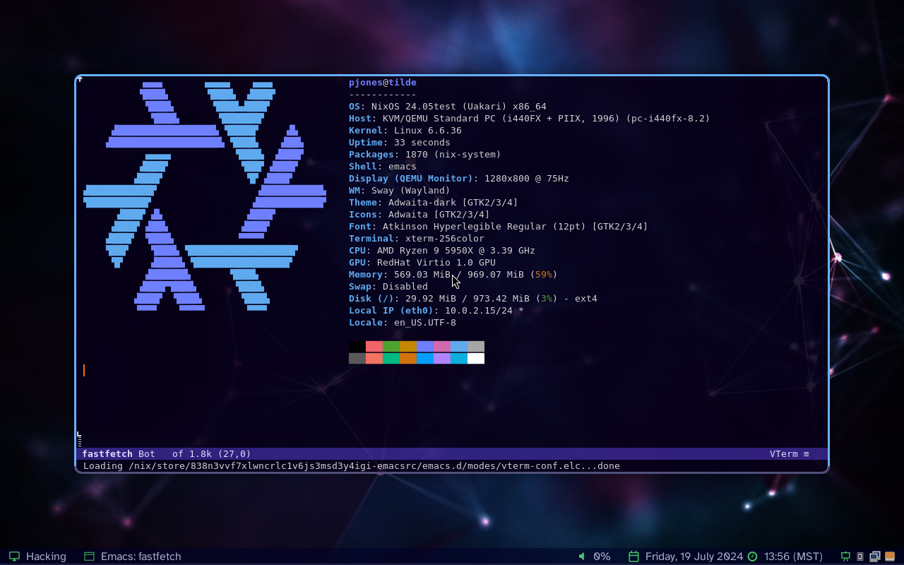

# There's No Place Like `~/`

<p align="center">
  
</p>

## Reproducible Configuration

Thanks to [Nix][], [nixpkgs][], and [home-manager][] this repository
can reproduce a working desktop environment exactly as configured
without having to tweak files by hand or in GUI settings tools.

The screenshot above was taken automatically by a non-interactive test
running in an ephemeral virtual machine (`nix flake check`).

## Details

  * Linux Distribution: [NixOS][nix]

  * Terminal: [Emacs][] w/ libvterm

  * Monospace Font: [Hermit](https://pcaro.es/p/hermit/)

  * Desktop: [SwayFX on Wayland][superkey]

## Try It Out

If you have [Nix][] installed and configured with flake support you
can run my configuration in a virtual machine:

```sh
nix run github:pjones/tilde
```

Use the key binding `Super+Space` to start `rofi`.  Other key bindings
can be found in my [Wayland configuration][superkey].

[nix]: https://nixos.org/
[nixpkgs]: https://github.com/NixOS/nixpkgs
[home-manager]: https://github.com/rycee/home-manager
[superkey]: https://github.com/pjones/superkey
[emacs]: https://github.com/pjones/emacsrc
